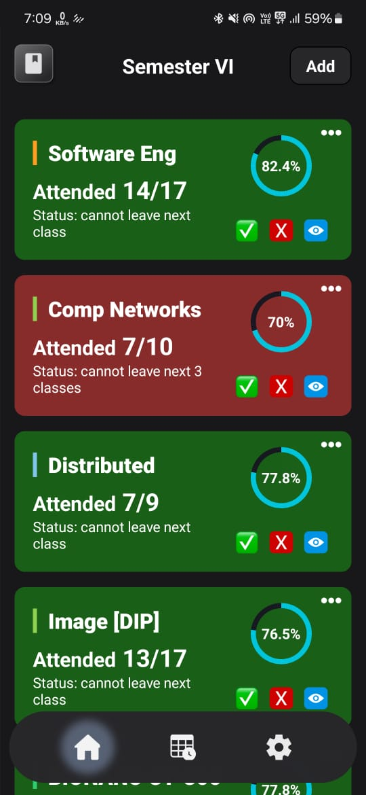
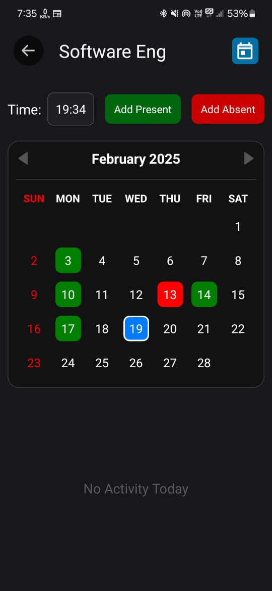
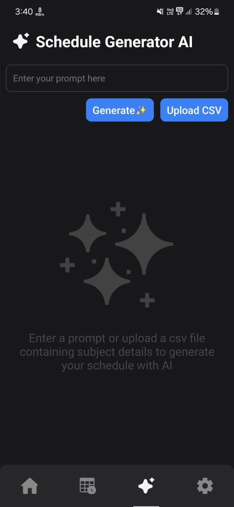
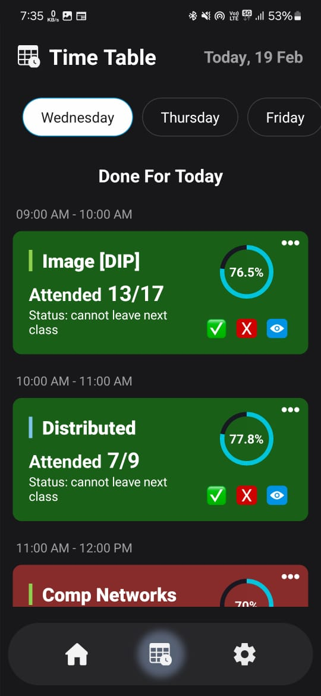

# Attendance & Time Table App

A **React Native** application to track and manage attendance efficiently. The app allows users to mark attendance, view attendance records, and analyze trends. Built with **React Native**, it ensures a smooth and responsive experience across both Android and iOS platforms.

- Designed on Figma ([link](https://www.figma.com/design/k0Mi0n6jNWGK5l1Jss1jbb/Untitled?node-id=0-1&t=fnfzmdtX0QVB6srI-1))

- Download at: [apk link](https://github.com/anisharma07/React-native-attendance-app/releases/download/v1.0.4/app-release.apk)

## Features

- 📊 **Track Attendance**: Easily mark attendance for different classes or events.
- 🤖 **AI Scheduling**: Generate your time table instantly and optimize your schedule.

- 📆 **Timetable Management**: Create, edit, and manage class or event timetables effortlessly.
- 🔔 **Reminders & Alerts**: Set alerts to remind you of low attendance.
- ☁️ **Cloud Sync (Optional)**: Sync data across multiple devices.


## App Screenshot

|  |  |  |
| --------------------------------------------- | --------------------------------------------- | ---------------------------------------------- |
|  |  |   |

## Installation & Setup

### Prerequisites

Ensure you have the following installed:

- **Node.js** (Latest LTS recommended) - [Download](https://nodejs.org/)
- **React Native CLI** or **Expo CLI**
- **Android Studio** (For Android emulator) / **Xcode** (For iOS development)

### Steps

#### 1. Clone the Repository

```sh
 git clone https://github.com/yourusername/attendance-manager.git
 cd attendance-manager
```

#### 2. Install Dependencies

```sh
 npm install
 # or
 yarn install
```

#### 3. Run the App

- For Android:

```sh
 npx react-native run-android
```

- For iOS (Mac users only):

```sh
 npx react-native run-ios
```

- If using Expo:

```sh
 npx expo start
```

#### 4. Firebase Setup Guide for React Native App

##### Step 1: Create a Firebase Project

1. Go to [Firebase Console](https://console.firebase.google.com/).
2. Click **"Add project"**, enter a project name, and follow the setup steps.
3. Once created, go to **Project Settings** and note down:
   - Project Number
   - Project ID
   - Storage Bucket

##### Step 2: Register Your App

1. In **Firebase Console**, go to **Project Settings > General**.
2. Under **Your apps**, click **Add App** and select **Android**.
3. Enter your **package name** (e.g., `com.yourappname`).
4. Follow the steps and download the `google-services.json` file.

##### Step 3: Configure API Keys and OAuth Clients

1. In **Firebase Console**, go to **Project Settings > Service Accounts**.
2. Set up authentication via **OAuth 2.0**.
3. Obtain API keys and OAuth client IDs.
4. Replace placeholders in `google-services.json` with actual values.

##### Step 4: Add `google-services.json` to Your Project

1. Place `google-services.json` inside your React Native project's `android/app/` directory.
2. Open `android/build.gradle` and add:
   ```gradle
   dependencies {
       classpath("com.google.gms:google-services:4.3.10") // Make sure it's the latest version
   }
   ```

## Tech Stack

- **React Native** - Frontend framework
- **Redux** - State management
- **AsyncStorage / Firebase** - Data persistence
- **React Navigation** - Seamless app navigation
- For more, refer to labels in repo's description.

## 🚀 Contribution Guidelines

1. **Fork** the repository.

2. **Select or create an issue** to work on.

3. **Create a branch** in your fork:

   ```bash
   git checkout -b feature/#<issue_number>
   ```

4. **Write meaningful commit messages**:

   ```bash
   git commit -m "feat: add AI scheduling option (fixes #42)"
   ```

   Types: `feat`, `fix`, `docs`, `style`, `refactor`, `test`, `chore`

5. Work on a single issue per PR.

6. Push and create a PR

## License

This project is licensed under the **MIT License**.

---

### 📩 Need Help?

For issues or suggestions, create a GitHub issue or contact me at [anis42390@gmail.com].
